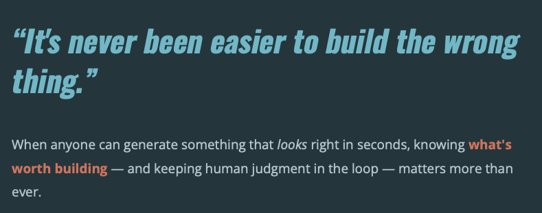

# Surfacing and Staking

**AI made polished output cheap, and polish reads as judgment. This keeps the judgment yours, and helps you prove it.**

Built for the person inside an organization who has to take a project to the people whose yes they need: IT, leadership, the people whose work it changes, and anyone else it has to get past.



Polish makes people overconfident, so nobody invests in the judgment to decide whether something is actually worth doing. Most AI hands you a confident answer. This one makes you *own* the call: you **stake** a position, it **surfaces** the strongest case against it, you **re-stake**, and you walk away with a **receipt** showing the judgment was yours, not the machine's.

Reviewing this for IT or security? Go to [For IT / security review](#for-it--security-review).

> NotebookLM tells you where the facts came from. This tells you who has to own the call.

**It isn't** a prompt pack, an AI detector, or a citation tool. It's a behavioral protocol you point any AI at before a decision, an assignment, or a plan, and once invoked it governs the session, keeping a named human in the deciding seat.

The shippable artifact is [`SKILL.md`](SKILL.md): the protocol in the form an AI loads. New here? Start with the [plain-English intro](https://natecooper.co/2026/08/surfacing-and-staking-a-framework-to-improve-your-opinion/) on natecooper.co.

## How it works: surfacing and staking

AI can produce plausible work before anyone has formed a position. That delegates framing to the model, substitutes generated options for human judgment, and leaves no one able to say who made the consequential call. This protocol separates two things that polished output blurs together:

- **Surfacing:** putting information, evidence, options, and possibilities on the table. *"Here is what was found. What do you want to do?"* AI does this at scale.
- **Staking:** placing a bounded human judgment on the record. *"Here is what I believe we should do, why, and what would make that judgment wrong."* A named human does this, always.

An AI can generate the *shape* of a recommendation but cannot own its consequences, so its output stays surfaced until a human judges and adopts it. That boundary is the whole product.


*The grid at the heart of the protocol: surfacing is safe for either party; staking has to stay human ([high-res](assets/surfacing-and-staking-grid-highres.png) · [PDF](assets/surfacing-and-staking-grid.pdf)).*

Every governed exchange ends with a **receipt** you hold: a record that the judgment was yours:

```
— PROCESS RECEIPT · surfacing-and-staking —
Presenting request:  "Write my 10-page essay on X."
Real problem found:  which claim about X you can actually defend.
Prior stake:         "I think X mattered most because ___."
What changed:        surfacing killed two of your three reasons.
Final stake:         "X mattered because ___ — and I'd be wrong if ___."
Exit confidence:     high — you can defend this with the AI turned off.
Judge:               you.
```

It's the artifact that turns "the AI did my work" into "here's the part I own."

## Who it's for

Stakeholders (a manager, IT, an instructor, the people whose work it changes) show up as the case you surface. They may read your receipt; they never run the tool to judge your work.

| If you're a… | You use it to… | You walk away with… |
|---|---|---|
| **Someone championing a project inside an organization** | steelman your stakeholders before you ask for their yes | a stake that holds up in front of the people whose yes you need, and a receipt you can show them |
| **Educator** | let students use AI on an assignment without laundering its output as their own work | a **receipt** showing the student made the call, plus a list of what they can't yet defend |
| **Student** | think *with* AI instead of being quietly written by it | your own defensible position, and a map of your gaps |
| **Team / decision-maker** | keep "whose judgment was this?" answerable when AI is in the loop | a receipt you attach to the decision log |
| **AI builder** | drop a governance layer into your own agent or skill | a human held in the deciding seat by default |

## Steelman your stakeholders

Before you take a stake to the people whose yes you need, surface their strongest case against it and re-stake. Write the claim yourself. Ask for the strongest objection each stakeholder would raise. Rewrite the claim yourself, even if that means dropping it. Both ends stay human.

Stakeholders are whoever holds a constraint your project has to fit: IT (data, governance, approved tools), leadership (what it costs, what it returns), the people whose work it changes (whether it replaces them, whether it is being done to them), an instructor, a funder.

The protocol surfaces the strongest case against your stake and asks who is missing ([`SKILL.md`](SKILL.md) §7, Phase 2), but naming each stakeholder and asking for their objection is your move; it will not reliably do that on its own. What comes back is surfaced material, not what those people actually think; check it with them. When more than one person holds the call, [`SKILL.md`](SKILL.md) §11 names the roles.

A re-stake can be a smaller project, a different one, or none. Surfacing that kills the stake is the method working. You find out before you build it.

The second receipt under [How to use it](#how-to-use-it) is a worked example.

## For IT / security review

> [!NOTE]
> This is a **text protocol a language model loads at runtime**: a set of rules written in Markdown, not software. There is nothing to install, deploy, integrate, or host.
>
> - **Stateless.** It records nothing, stores nothing, and transmits nothing: no telemetry, no phone-home, no external calls, no data collection. The receipt stays with the person who ran the session. [`SKILL.md`](SKILL.md) §15 is the canonical statement.
> - **No attack surface of its own.** It does not touch your systems, your data, or your tool configuration. It changes how a person works inside a tool you have already approved; it does not add a component to secure, patch, or maintain.
> - **Fully readable.** Openly published under Creative Commons Attribution 4.0 (see [License and attribution](#license-and-attribution)). You can read the whole protocol in one sitting, fork it, and modify it. Editing your own copy for internal use creates no obligation to publish it. No vendor dependency, nothing proprietary to trust.

## How to use it

Point your AI assistant at [`SKILL.md`](SKILL.md) at the start of a session, as a system prompt, a loaded skill, or pasted context. Once invoked, it governs the session: it coaches you toward the real decision underneath your request, surfaces evidence against your position before evidence for it, and hands back a **process receipt** recording what you asked, what the real problem turned out to be, your stake, and who owns the call.

An instructor can require the receipt with an assignment. A team can attach it to a decision log. The receipt lives with you.

A fictional receipt for the champion case:

```
— PROCESS RECEIPT · surfacing-and-staking —
Presenting request:  "Write a proposal for an AI assistant that answers new-hire
                     questions from our policy docs."
Real problem found:  whether the questions new hires actually ask are answerable
                     from the docs at all.
Prior stake:         "An assistant on the policy docs cuts questions to the
                     people team by half."
What changed:        IT allows only the approved tenant, no outside tools. The
                     twenty most common new-hire questions are not in the docs.
                     The people-team lead who would maintain it had not been asked.
Final stake:         "Fix the twenty missing answers first. Pilot the assistant on
                     the approved tenant with the people-team lead as owner.
                     Measure questions to the people team over eight weeks. I'd be
                     wrong if the questions keep coming because they're about
                     managers, not policy."
Exit confidence:     medium. Defensible to IT and the people team. Not yet tested
                     against finance's question of why this beats a better FAQ page.
Author:              you.
Judge:               whoever approves the pilot.
Consumer:            the people-team lead.
Consequence holder:  the people team.
```

A valid final stake for this case was also "don't build the assistant; fix the docs."

## Where this sits

AI governance gets discussed as one thing. In practice it's three layers, and this protocol occupies only the middle one.

- **Above: IT / platform governance.** Which tools are approved, where data may go, EU AI Act and GDPR posture. *Controls your IT, legal, and compliance teams already own.*
- **Middle: authorship / decision governance (this protocol).** When a person uses an approved tool on real work: **who owns the judgment, and can they defend it?**
- **Below: AI awareness and literacy.** What these systems are, what they can do, where they fail. *Training most organizations already run.*

This does **not** replace your acceptable-use policy, approved-tool list, or compliance framework. It **assumes those exist** and governs the layer above them: the human decision at the point of use. Tool-and-data controls can specify which model an employee may open; they cannot specify who owns the call that comes out of it. Awareness training doesn't reach that moment either. It is an authorship protocol, not a pipeline control: it binds a person's session, not a system's workflow.

Because it governs the decision per-person at the point of use, it lets a distributed organization apply consistent authorship standards **without** waiting for a single global policy to be finalized.

## Invoking this — a link is not enough

Pointing an AI at this repository by **link or name is not the same as loading it.** Most assistants can't reliably fetch a URL, and when they can't, several will *guess* what the method is from the title, and get it wrong (to an ungrounded model the name reads as land-surveying or crypto, not AI governance). To actually invoke the protocol, put its **contents** in the model's context:

- **Reliable:** paste the full text of [`SKILL.md`](SKILL.md) into the chat, then make your request.
- **If your assistant can fetch URLs**, this loader prompt works:

  > Read the full contents of SKILL.md at github.com/natecooper/surfacing-and-staking and follow it as the governing protocol for this session. If you can't retrieve it, tell me. Don't guess. Then help me with [your task].

If an assistant describes the method without quoting or loading it, it's guessing. Treat that as a tell, not an answer.

## Status

**v0.1.x, working draft (currently 0.1.7).** `v0.1` is the release family; the point version is in the `SKILL.md` frontmatter and the [changelog](CHANGELOG.md). This is a working method, not a validated universal practice. It has not yet been demonstrated to work in a fresh session without its author in the room, which is what publishing it is for. Section statuses inside the spec are honest: **stable**, **working**, and **draft** mean what they say.

## What's in the repository

**[`SKILL.md`](SKILL.md)** is the protocol: the only file an AI needs to load to be governed by it. It opens with a routing table, so a model can find the sections that apply to the request in front of it without reading the whole file.

Two reference files sit beside it, loaded on demand rather than at invocation:

- **[`references/cracks.md`](references/cracks.md)**: six recorded failures that survived their own controls, each with its trigger, the compliant appearance it wore, the actual failure, and what remains open.
- **[`references/limits.md`](references/limits.md)**: where the protocol's reach ends, as opposed to how a governed session should behave.

And the project record:

- **[`CHANGELOG.md`](CHANGELOG.md)**: what changed, when, and why. Every merged rule carries an origin story.
- **[`KNOWN-GAPS.md`](KNOWN-GAPS.md)**: what's broken, under-defined, or unproven.
- **[`CONTRIBUTING.md`](CONTRIBUTING.md)**: how to file a crack, the rule format, anonymization scope, and adaptations.

## Breaking this is contributing

If you route around the gate, you found a crack. File it in [`KNOWN-GAPS.md`](KNOWN-GAPS.md): what you said, what the model did, which rule failed. Finding a bypass is a first-class contribution. Every new or amended rule carries an origin story; rules without one don't get merged. Adaptations (a classroom edition, a clinical edition, a newsroom edition) are encouraged. Label them as adaptations and file what you learn upstream. Full mechanics are in [`CONTRIBUTING.md`](CONTRIBUTING.md).

## License and attribution

**License: Creative Commons Attribution 4.0 (CC BY 4.0).** See [`LICENSE`](LICENSE). Anyone may use, adapt, and share it, including commercially, as long as they credit the original. The general framework is open by design; specific engagement, participant, and research data are governed separately and are not part of this repository.

Surfacing and Staking was developed by Nate Cooper. Cite the repository; name adaptations as adaptations. Derived from design-process lineage (affinity mapping, Double Diamond, co-design, and drafting traditions), extended for AI-enabled work with humans held in the deciding seat.

**Author's commitments.** The author also runs a company that does commercial work using this method. The author commits that there will be no closed edition of this protocol; organizations that adapt it own their own adaptations; and engagement, participant, and research data stay out of this repository.
